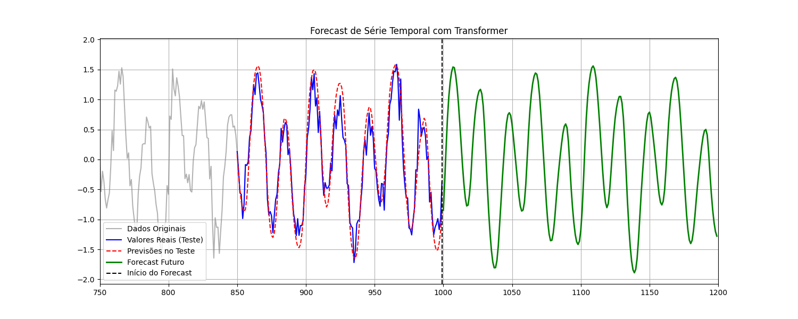

# Previsão de Séries Temporais com Transformer em PyTorch

Este projeto implementa uma arquitetura de Rede Neural baseada em **Transformer** (Attention Is All You Need) construída em PyTorch para a tarefa de **Forecasting de Séries Temporais**. 

Diferente de modelos tradicionais (como ARIMA) ou redes recorrentes, este modelo utiliza o mecanismo de *Multi-Head Attention* para identificar padrões complexos e dependências de longo prazo em dados sequenciais.

## Como o Modelo Funciona

O projeto resolve o problema de previsão transformando uma série contínua em um problema de aprendizado supervisionado usando a arquitetura Transformer através de janelas deslizantes:

1. O modelo observa os últimos `N` dias (ex: 50 dias).
2. Ele tenta prever o dia `N + 1`.
3. Para prever passos futuros, o modelo assume uma postura autorregressiva, consumindo a própria previsão anterior para dar o próximo passo.

### A Matemática por Trás
Como o Transformer processa toda a janela de tempo de uma vez e não possui recorrência embutida, então foi implementada uma camada de **Positional Encoding** baseada em funções de seno e cosseno para injetar a noção de tempo e ordem matemática nos dados.

## Tecnologias Utilizadas

* **Linguagem:** 3.14.3
* **Deep Learning:** PyTorch (`torch`, `torch.nn`)
* **Pré-processamento:** Scikit-learn (`MinMaxScaler`)
* **Métricas:** Scikit-learn (`MSE`, `RMSE`, `MAE`)
* **Visualização:** Matplotlib, Numpy

## Estrutura do Projeto

```text
ts_transformer_forecast/
│
├── src/
│   ├── data_prep.py     # Lógica de Janela Deslizante e DataLoaders
│   └── model.py         # Classes PositionalEncoding e TimeSeriesTransformer
│
├── main.py              # Script principal de treinamento e avaliação
├── README.md            # Documentação do projeto
└── requirements.txt     # Dependências
```

## Como Executar

**1. Clone o repositório e acesse a pasta:**

```bash
git clone https://github.com/douglastein/time-series-transformer.git
cd time-series-transformer
```

**2. Instale as dependências:**

```bash
pip install -r requirements.txt
```

**3. Execute o pipeline de treinamento:**

```bash
python main.py
```
O script irá automaticamente:
- Detectar se você possui uma GPU (CUDA/MPS) ou se rodará na CPU.
- Treinar o modelo exibindo a Loss a cada 10 épocas.
- Calcular as métricas de erro no conjunto de teste.
- Gerar um gráfico comparativo e salvá-lo como `forecast_plot.png`.


## Resultados e Avaliação

Após o treinamento, o modelo avalia sua performance comparando os valores reais com as previsões da base de teste. 

As métricas geradas no console são:
* **MSE (Mean Squared Error):** Penaliza erros grandes.
* **RMSE (Root Mean Squared Error):** Erro na mesma unidade da série.
* **MAE (Mean Absolute Error):** Média absoluta de erro por previsão.

Abaixo é possível observar um possível forecasting com os dados e hiperparâmetros utilizados.
> 

---
Desenvolvido como estudo de Deep Learning aplicado a Séries Temporais (Projeto 4 - Matemática e Estatística para Data Science).